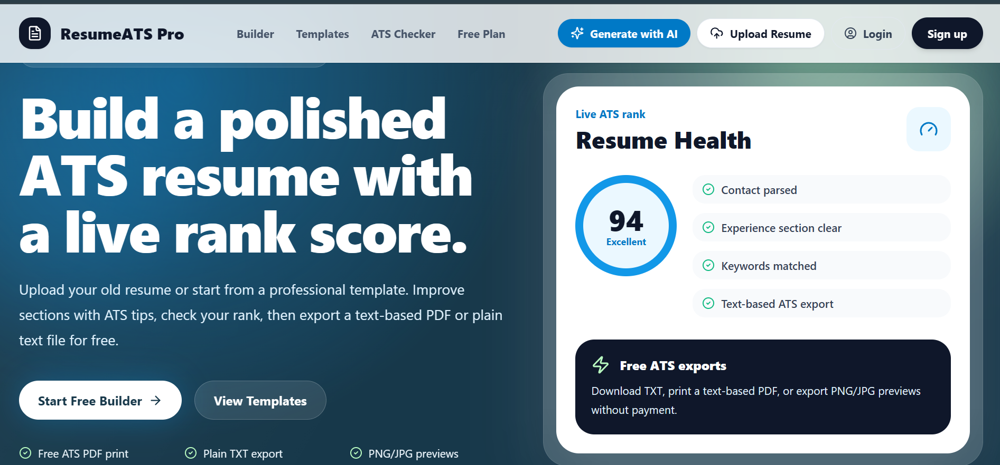
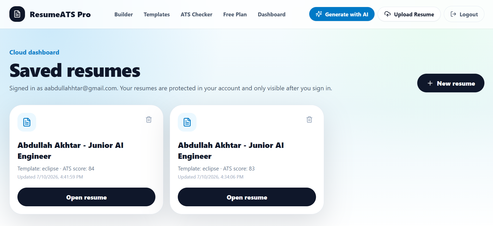
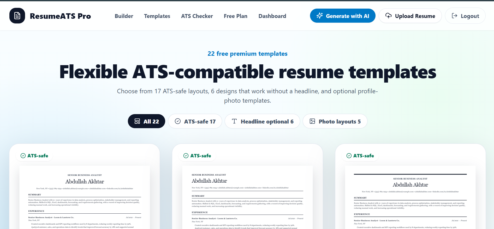
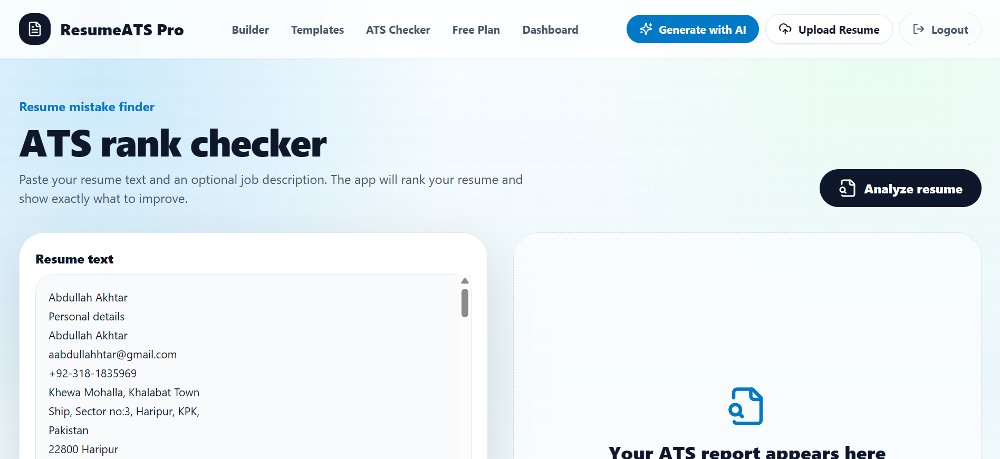
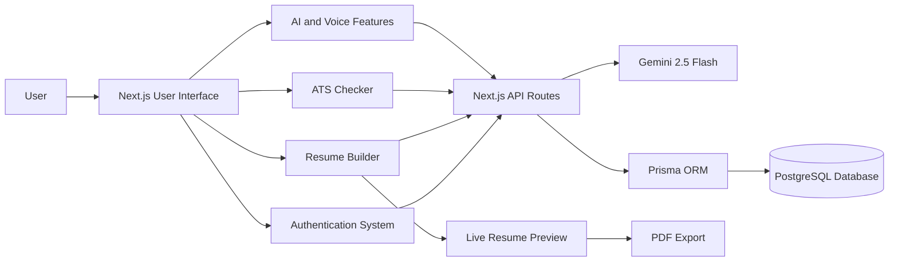

<div align="center">


# 📄 ResumeATS Pro

### Build professional, ATS-friendly resumes with artificial intelligence

ResumeATS Pro helps students, graduates, career changers, and job seekers create, improve, analyze, save, and export professional resumes.

<br>

[](https://zingy-zuccutto-be576c.netlify.app/)
[](https://github.com/aabdullahhtar-create/Resume-ATS-Pro)

<br>


</div>

---

## 📑 Table of Contents

* [About the Project](#-about-the-project)
* [The Problem](#-the-problem)
* [The Solution](#-the-solution)
* [Target Users](#-target-users)
* [Live Application](#-live-application)
* [Features](#-features)
* [Screenshots](#-screenshots)
* [AI-Powered Feature](#-ai-powered-feature)
* [AI System Instructions](#-ai-system-instructions)
* [Application Architecture](#-application-architecture)
* [Technology Stack](#-technology-stack)
* [Project Structure](#-project-structure)
* [Running the Project Locally](#-running-the-project-locally)
* [Environment Variables](#-environment-variables)
* [Security](#-security)
* [Future Improvements](#-future-improvements)
* [Originality Statement](#-originality-statement)
* [Author](#-author)

---

## 🌟 About the Project

**ResumeATS Pro** is a complete AI-powered resume-building platform. It allows users to create professional resumes, choose templates, analyze resumes against job descriptions, receive ATS recommendations, improve resume content with AI, and export completed resumes.

The project combines resume creation, AI assistance, ATS analysis, authentication, database storage, voice input, resume uploading, and PDF export in one application.

---

## ❗ The Problem

Many students, fresh graduates, and first-time job seekers have valuable skills and experience but struggle to present them professionally.

Common problems include:

* Writing weak professional summaries
* Using unclear or repetitive experience descriptions
* Submitting the same resume for every job
* Missing important job-description keywords
* Creating resumes that are difficult for ATS software to process
* Paying expensive professional resume-writing fees
* Not knowing whether a resume is ready for submission

These problems can reduce a candidate’s chances of passing an initial resume screening.

---

## 💡 The Solution

ResumeATS Pro gives job seekers one platform where they can:

* Build a resume from beginning to end
* Save and manage multiple resumes
* Select professional resume templates
* View changes through a live preview
* Compare a resume with a job description
* Receive an ATS compatibility analysis
* Generate and improve resume content with AI
* Enter resume information through voice interaction
* Upload an existing resume
* Export the completed resume as a PDF

The goal is to make professional resume-building more accessible to students and early-career applicants.

---

## 👥 Target Users

| User Group                 | How ResumeATS Pro Helps                                           |
| -------------------------- | ----------------------------------------------------------------- |
| 🎓 Students                | Creates professional resumes for internships and entry-level jobs |
| 🧑‍🎓 Fresh graduates      | Presents education, skills, and projects professionally           |
| 💼 Job seekers             | Tailors resumes toward specific job descriptions                  |
| 🔄 Career changers         | Repositions existing experience for a new career                  |
| 🌱 First-time applicants   | Provides AI-supported resume-writing guidance                     |
| 📋 Multiple-job applicants | Supports different resumes for different opportunities            |

---

## 🚀 Live Application

<div align="center">

### [Open ResumeATS Pro](https://zingy-zuccutto-be576c.netlify.app/)

The application is deployed publicly on Netlify and can be accessed without downloading the source code.

</div>

---

## ✨ Features

<table>
<tr>
<td width="50%" valign="top">

### 🔐 Authentication

* User registration
* Secure login and logout
* Google OAuth support
* Session-based authentication
* Protected application pages

### 📄 Resume Management

* Create new resumes
* Save resume information
* Edit existing resumes
* Delete resumes
* Access resumes from a dashboard

### 🎨 Resume Builder

* Personal information
* Professional summary
* Work experience
* Education
* Skills
* Projects
* Certifications
* Live resume preview

</td>
<td width="50%" valign="top">

### 🤖 Artificial Intelligence

* AI resume generation
* Professional summary generation
* Experience bullet improvement
* Job-description analysis
* Resume recommendations
* Keyword suggestions

### 📊 ATS Analysis

* ATS resume checking
* Job-description comparison
* Matched keyword identification
* Missing keyword identification
* Resume improvement suggestions

### 📤 Additional Tools

* Resume uploading
* Voice resume assistant
* Multiple resume templates
* PDF resume export
* Responsive interface

</td>
</tr>
</table>

---


## 🖼️ Screenshots

<div align="center">

<p>
The screenshots below highlight the main ResumeATS Pro pages and workflows.
</p>

<br>

<h3>🏠 Landing Page</h3>

<p>Explore ResumeATS Pro, review its key benefits, and start building an ATS-friendly resume.</p>



<br><br><br>

<h3>📊 Saved Resumes Dashboard</h3>

<p>Create, manage, edit, and access saved resumes securely from the user dashboard.</p>



<br><br><br>

<h3>🎨 Resume Templates</h3>

<p>Browse flexible ATS-compatible resume templates and select a layout for your resume.</p>



<br><br><br>

<h3>🤖 ATS Rank Checker</h3>

<p>Paste resume content, compare it with a job description, and receive ATS improvement guidance.</p>



<br>

</div>

---

## 🤖 AI-Powered Feature

### AI Resume Generator and ATS Assistant

ResumeATS Pro uses the **Google Gemini 2.5 Flash** model to help users improve their resume content.

The AI feature can:

1. Generate a professional summary from user information.
2. Rewrite weak experience descriptions using action-oriented language.
3. Analyze a target job description.
4. identify important job-related keywords.
5. Suggest potentially missing skills and keywords.
6. Recommend changes that may improve ATS compatibility.
7. Organize the generated content into resume-friendly sections.

The AI is instructed not to intentionally invent employers, degrees, certifications, experience, achievements, or qualifications.

Users remain responsible for reviewing AI-generated content before placing it in their final resume.

---

## 🧠 AI System Instructions

<details>
<summary><strong>Click to view the AI instructions/system prompt</strong></summary>

```text
You are an expert resume-writing assistant and Applicant Tracking System
optimization specialist.

Your responsibility is to help users create professional, concise, and
ATS-friendly resumes while remaining truthful to the information provided
by the user.

Follow these rules:

1. Never invent employers, job titles, employment dates, education,
   certifications, projects, skills, achievements, or qualifications.

2. Use only the information provided by the user.

3. Improve weak resume wording using clear and professional language.

4. Begin experience bullet points with strong action verbs when appropriate.

5. Keep professional summaries concise and relevant to the target role.

6. Compare the resume with the provided job description.

7. Identify keywords that appear in both the resume and job description.

8. Identify important job-description keywords that may be missing from
   the resume.

9. Only recommend a keyword when it is relevant to the information
   provided by the user.

10. Do not add unsupported numerical achievements or exaggerated claims.

11. Avoid first-person pronouns, vague expressions, and unnecessary
    adjectives.

12. Return structured and easy-to-read content.

13. Explain when additional information is required instead of inventing
    missing information.

14. Remind the user to verify every AI-generated suggestion before using it.
```

</details>

---

## 🏗️ Application Architecture



---

## 🛠️ Technology Stack

| Technology              | Purpose                                   |
| ----------------------- | ----------------------------------------- |
| Next.js 15              | Full-stack web application framework      |
| React 19                | User-interface components                 |
| TypeScript              | Type-safe application development         |
| Tailwind CSS            | Responsive styling and layout             |
| Framer Motion           | Interface animations and transitions      |
| Next.js API Routes      | Backend endpoints                         |
| Prisma 6                | Database ORM                              |
| PostgreSQL              | User and resume data storage              |
| Google Gemini 2.5 Flash | AI resume generation and analysis         |
| Jose                    | Session and authentication token handling |
| Zod                     | Server-side data validation               |
| jsPDF                   | Resume PDF generation                     |
| html2canvas             | Capturing resume layouts for export       |
| Mammoth                 | Processing supported document uploads     |
| PDF Parse               | Extracting text from uploaded PDF resumes |
| Lucide React            | Application icons                         |
| Netlify                 | Public application deployment             |
| GitHub                  | Source-code hosting and version control   |

---

## 📁 Project Structure

```text
Resume-ATS-Pro/
│
├── mobile-fallback/
│   └── index.html
│
├── prisma/
│   ├── migrations/
│   └── schema.prisma
│
├── public/
│   ├── screenshots/
│   └── template-reference.png
│
├── scripts/
│   └── check-auth-setup.mjs
│
├── src/
│   ├── app/
│   │   ├── api/
│   │   ├── ats-checker/
│   │   ├── builder/
│   │   ├── dashboard/
│   │   ├── generate-ai/
│   │   ├── login/
│   │   ├── signup/
│   │   └── templates/
│   │
│   ├── components/
│   ├── lib/
│   ├── types/
│   └── middleware.ts
│
├── .env.example
├── .gitignore
├── netlify.toml
├── next.config.mjs
├── package.json
├── tailwind.config.ts
├── tsconfig.json
└── README.md
```

---

## ⚙️ Running the Project Locally

### Prerequisites

Install the following:

* Node.js 18 or newer
* npm
* A PostgreSQL or Neon database
* A Google Gemini API key
* Google OAuth credentials for Google login

### 1. Clone the repository

```bash
git clone https://github.com/aabdullahhtar-create/Resume-ATS-Pro.git
```

### 2. Enter the project folder

```bash
cd Resume-ATS-Pro
```

### 3. Install dependencies

```bash
npm install
```

### 4. Create the environment file

Create a file named:

```text
.env.local
```

Copy the variable names from `.env.example` and add your own private values.

### 5. Prepare Prisma

```bash
npx prisma generate
npm run db:push
```

### 6. Start the development server

```bash
npm run dev
```

Open the following address:

```text
http://localhost:3000
```

### 7. Create a production build

```bash
npm run build
npm start
```

---

## 🔐 Environment Variables

Create `.env.local` in the project root:

```env
DATABASE_URL="your_postgresql_connection_string"

SESSION_COOKIE_NAME="resume_ats_session"

NEXT_PUBLIC_APP_URL="http://localhost:3000"
APP_URL="http://localhost:3000"

GOOGLE_CLIENT_ID=""
GOOGLE_CLIENT_SECRET=""

GEMINI_API_KEY=""
GEMINI_MODEL="gemini-2.5-flash"
```

For the deployed Netlify application, change both app URL variables to the deployed URL:

```env
NEXT_PUBLIC_APP_URL="https://your-deployed-site.netlify.app"
APP_URL="https://your-deployed-site.netlify.app"
```

Do not commit `.env` or `.env.local`.

---

## 🔒 Security

ResumeATS Pro follows these basic security practices:

* Environment files are excluded through `.gitignore`.
* API keys are stored in environment variables.
* Database credentials are not included in the repository.
* Server-side validation is performed with Zod.
* Authentication tokens are handled through secure server-side logic.
* A safe `.env.example` file documents required variables without exposing secrets.

---

## 🧪 Main Workflows Tested

* User registration
* User login and logout
* Google authentication
* Resume creation
* Resume editing
* Resume saving
* Resume deletion
* Resume-template selection
* Live resume preview
* AI resume generation
* ATS resume analysis
* Resume uploading
* Voice resume interaction
* PDF exporting
* Responsive navigation
* Database connection
* Environment-variable validation

---

## 🚧 Future Improvements

* [ ] Additional resume templates
* [ ] AI cover-letter generator
* [ ] Interview preparation assistant
* [ ] Resume version history
* [ ] LinkedIn profile optimization
* [ ] Multiple-language support
* [ ] Advanced ATS scoring
* [ ] Resume grammar and spelling checker
* [ ] Recruiter feedback tools
* [ ] Application tracking dashboard

---


## 👨‍💻 Author

<div align="center">

### Abdullah Akhtar

[](https://github.com/aabdullahhtar-create)

<br>

Developed as an individual academic final project.

<br>

**Made with Next.js, TypeScript, PostgreSQL and Gemini AI.**

</div>
